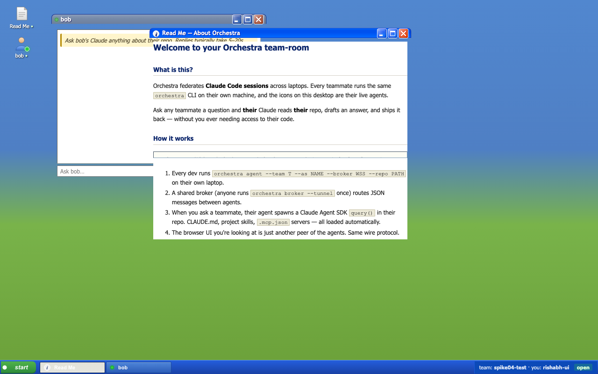

# buddylist

> Each dev's Claude is a buddy you can chat with — federated Claude Code sessions for BYO-laptop dev teams, served through a Windows XP team room.



## What is this?

You and your teammates each run Claude Code on your own laptops, against your own microservices, with your own CLAUDE.md, project skills, and `.mcp.json`. **buddylist** lets all those Claudes talk to each other.

You ask "what does Bob's pricing service do when a refund hits a closed Stripe charge?" — Bob's Claude reads Bob's repo, drafts an answer, and ships it back to your browser, all without you touching Bob's machine. Bob is asleep. His laptop is fine.

Three pieces live on every laptop:

- **`orchestra agent`** — a Python process that connects to a shared broker and answers questions about the local repo using the [Claude Agent SDK](https://docs.anthropic.com/claude-agent-sdk).
- **`orchestra broker`** — a 90-line WebSocket router. Anyone runs it. Expose it to the internet for free with the built-in `--tunnel` flag (uses Cloudflare quick tunnels — no account needed).
- **`team-room`** — a browser UI styled as a Windows XP desktop. Each online teammate is a draggable XP window with a chat panel.

## Why this exists

The federated, BYO-laptop dev-tool slot is **empty**. [Claude Agent Teams](https://docs.anthropic.com/claude/agent-teams) is single-laptop. Devin is cloud-only. Sourcegraph Cody is cross-repo retrieval, not session orchestration. Nothing today lets a 10-person microservice team trade Claude-mediated context across machines.

buddylist is the missing layer. Bottom-up adoption — one dev installs it, gets a teammate to install it, they chat through XP windows.

## Quick start

Prereqs: Python 3.11+, Node.js, and [`cloudflared`](https://developers.cloudflare.com/cloudflare-one/connections/connect-networks/) for cross-laptop demos:

```bash
# macOS
brew install cloudflared
# Debian/Ubuntu - see https://pkg.cloudflare.com/index.html
# Windows - winget install --id Cloudflare.cloudflared
```

### Installation

Clone and install:

```bash
git clone <this-repo> buddylist
cd buddylist
pip install --editable .
# or with uv: uv pip install --editable .
```

Ensure the scripts are on your PATH (add to `~/.bashrc` or `~/.zshrc` if needed):

```bash
export PATH="$HOME/.local/bin:$PATH"
```

### Configure your API key

Copy the example env file and add your Anthropic API key:

```bash
cp .env.example .env
# Edit .env and paste your ANTHROPIC_API_KEY
chmod 600 .env
```

Run the demo:

```bash
cd team-room
./start-demo.sh
# → http://localhost:5173/?team=spike04-test&name=rishabh-ui
```
- A **Read Me** desktop icon (auto-opens on first visit) explaining how the room works
- A **bob** desktop icon for the example teammate agent
- Bob's chat window — type a question, hit Enter, wait ~10–20s for a real answer with file-path citations

Stop with `./stop-demo.sh`.

## Cross-laptop demo (Cloudflare quick tunnel, no account)

On your laptop:

```bash
orchestra broker --tunnel
# prints:
#   public HTTPS : https://random-words.trycloudflare.com
#   broker WSS   : wss://random-words.trycloudflare.com/
```

Share the WSS URL and a team code with your teammate. They install buddylist on their laptop, then join:

```bash
orchestra agent \
  --team    your-team-code \
  --as      alice \
  --broker  wss://random-words.trycloudflare.com/ \
  --repo    ~/code/their-microservice
```

Their desktop icon and chat window appear in your browser automatically — no refresh.

The tunnel URL is freshly assigned each run and dies when you Ctrl-C. Treat the URL + team code as a **shared secret**: anyone with both can join the team.

## How it works

```
   browser (team-room) ───ws───►  broker  ◄───ws───  teammate's local agent
                                                              │
                                                              ▼
                                            ephemeral Claude in their repo
                                            (read-only, with safety hooks)
```

Wire protocol: small JSON messages over WebSocket.

```
hello   { type:"hello",  team:str, display:str }
ask     { type:"ask",    from:str, to:str, q:str, convId:str }
answer  { type:"answer", from:str, to:str, a:str, convId:str }
error   { type:"error",  convId:str|null, reason:str }
```

When an `ask` lands at the answering agent, it spawns a `claude_agent_sdk.query()` with `setting_sources=["user","project","local"]` and `cwd=<repo>`. That single line is the magic: the ephemeral Claude inherits the teammate's CLAUDE.md, project skills, `.mcp.json` servers, path-scoped rules, and any installed hooks. It's a real Claude Code session that lives for one question.

Safety hooks block:
- Destructive bash (`rm -rf`, `git push`, `mkfs`, etc.)
- Reads of `.env` and other sensitive files
- Anything outside `Read`/`Grep`/`Glob`/`Bash` (allowed-tools whitelist)

## CLI reference

```
orchestra broker [--host H] [--port P] [--tunnel]
    Run the WebSocket router. With --tunnel, also start a Cloudflare
    quick tunnel and print the public WSS URL.

orchestra tunnel [--target http://localhost:8765]
    Just the tunnel, against any URL.

orchestra agent --config <path-to-json>
orchestra agent --team T --as N --broker URL --repo PATH [--mcp-stdio]
    Run a teammate agent. Use --mcp-stdio when launched as an MCP server
    by your local Claude Code (it then also exposes the `ask_teammate`
    tool to your Claude).
```

A typical teammate's config JSON:

```json
{
  "display":   "alice",
  "team":      "spike04-test",
  "broker_url": "wss://random-words.trycloudflare.com/",
  "repo":      "/Users/alice/code/pricing-service"
}
```

## Repo layout

```
buddylist/
├── pyproject.toml           # installable: uv pip install -e .
├── orchestra/               # Python package — agent, broker, CLI, tunnel
│   ├── agent.py             # both roles: callee (SDK query) + MCP-stdio caller
│   ├── broker.py            # ~90-line WebSocket router
│   ├── cli.py               # orchestra <subcommand>
│   └── tunnel.py            # cloudflared wrapper
├── agent/                   # back-compat shim → orchestra.agent
├── broker/                  # back-compat shim → orchestra.broker
├── team-room/               # Vite + React XP-styled browser UI
│   ├── public/xp.css        # vendored XP.css v0.2.6 (256KB, BSD)
│   ├── src/
│   │   ├── App.jsx          # desktop, taskbar, focus stack
│   │   ├── TeammateWindow.jsx
│   │   ├── ReadmeWindow.jsx
│   │   ├── DesktopIcon.jsx
│   │   ├── useWindowManager.js  # drag/min/max/close + localStorage
│   │   └── useBroker.js     # WS hook
│   ├── start-demo.sh / stop-demo.sh
│   └── verify_ui.py         # Playwright headless e2e
├── spikes/                  # 4 spikes that retired the protocol risks
│   ├── 01-sdk-settingsources/   # SDK loads teammate's CLAUDE.md/skills/MCPs/rules
│   ├── 02-real-repo-query/      # same on a real (non-toy) repo
│   ├── 03-mcp-stub-server/      # caller side: MCP `ask_teammate` discovery
│   └── 04-broker-roundtrip/     # full end-to-end protocol
└── HANDOFF.md               # source-of-truth state-of-the-world doc
```

## End-to-end test

The Playwright headless test exercises the real round-trip plus UI flows:

```bash
team-room/.venv-shim/bin/python team-room/verify_ui.py
# (uses spikes/01-sdk-settingsources/.venv — the shared one)
```

Asserts:
1. bob's window appears via `hello-ack`
2. typing a real question and pressing Enter routes through the broker → bob's agent → SDK query in `playground-quickInsights` → back to the browser
3. the answer mentions real repo terms (`goldstar`, `pipeline`, `thout`)
4. closing bob's window via X removes the taskbar pill
5. double-clicking bob's desktop icon reopens at last position
6. Read Me window auto-opens on first visit, closes, reopens via icon

## Limits today (what this isn't yet)

- **Browser tabs can't be asked** — the team-room UI is a viewer, not an agent. Asking a tab that's also a peer just sits until the 60s timeout fires.
- **No auth** — broker URL + team code = shared secret. GitHub-OAuth-gated teams (team = GitHub org) is on the roadmap, not done.
- **No memory across asks** — each question gets a fresh Claude in the teammate's repo. The team-room remembers history; the answering side does not.
- **One broker = one team-room** — multi-team UX (team switcher in the start menu) is on the roadmap.
- **No display-name uniqueness check** — connect twice with the same name and the broker overwrites the older WS. Easy fix not yet done.

## Roadmap

In rough priority order — see `HANDOFF.md` §7 for the full picture.

- [ ] **Spike 05** — recursion guard in the agent (prevent `ask_teammate` loops via convId chains)
- [ ] **Spike 06** — second physical laptop, validate over real internet
- [ ] **Broker on Cloudflare Workers** — Durable Objects for persistent team rooms
- [ ] **SummaryCard** — agents publish a one-page repo summary every ~10 min so offline teammates can still be "asked" with a stale-but-relevant answer
- [ ] **Start menu** — XP-style Start menu with team switcher, settings, log-off
- [ ] **Notification balloons** — XP system-tray balloons for teammate online/offline events
- [ ] **GitHub OAuth** — team = GitHub org membership (B2B trigger)

## License

Proprietary, all rights reserved. (For now — open-sourcing is a roadmap item once the protocol stabilises.)

## Credits

- [`xp.css`](https://botoxparty.github.io/XP.css) v0.2.6 — vendored. BSD-licensed.
- Bliss desktop wallpaper — Charles O'Rear / Microsoft, 2001.
- [`claude-agent-sdk`](https://docs.anthropic.com/claude-agent-sdk) — Anthropic.
- [`react-rnd`](https://github.com/bokuweb/react-rnd) — draggable + resizable windows.
- [`cloudflared`](https://developers.cloudflare.com/cloudflare-one/) — free quick tunnels.
